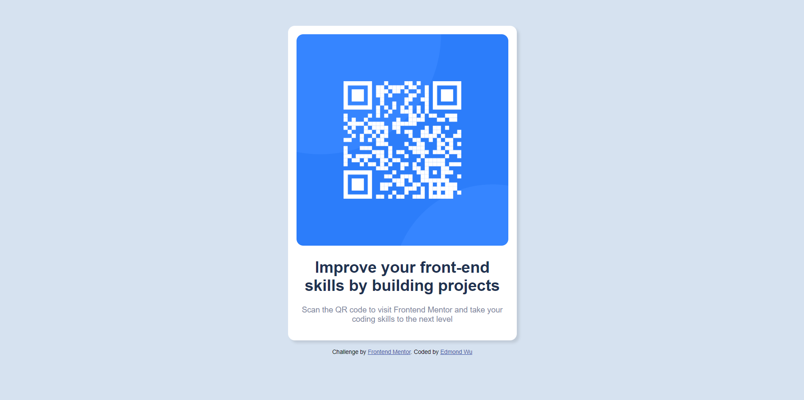

# Frontend Mentor - QR code component solution

This is a solution to the [QR code component challenge on Frontend Mentor](https://www.frontendmentor.io/challenges/qr-code-component-iux_sIO_H). Frontend Mentor challenges help you improve your coding skills by building realistic projects. 

## Table of contents

- [Frontend Mentor - QR code component solution](#frontend-mentor---qr-code-component-solution)
  - [Table of contents](#table-of-contents)
  - [Overview](#overview)
    - [Screenshot](#screenshot)
    - [Links](#links)
  - [My process](#my-process)
    - [Built with](#built-with)
    - [What I learned](#what-i-learned)
    - [Continued development](#continued-development)
  - [Author](#author)

## Overview
Using HTML5 and CSS, I created a QR code page that displays the QR code that leads to FrontEnd Mentor. As a newbie project, this is perfect as it uses simple HTML and CSS. It allowed me to understand what every specific custom CSS property did and it help reinforce the use of both HTML and CSS.

### Screenshot



### Links
- Live Site URL: [Add live site URL here](https://edmond-wu-9.github.io/qr_code_fm/)

## My process

### Built with

- Semantic HTML5 markup
- CSS custom properties
- Flexbox

### What I learned

Use this section to recap over some of your major learnings while working through this project. Writing these out and providing code samples of areas you want to highlight is a great way to reinforce your own knowledge.

```css
:root {
  --white: hsl(0,0,0); /*Sets universal variables*/
}

body{
    display: flex;  /*Centers the container to the page from here down to height*/
    flex-direction: column;
    align-items: center;
    justify-content: center;
    height: calc(100vh - 1px);
}
```
### Continued development
Still not the best at CSS and flexbox. Need to understand the concepts of CSS and practically applying it 


## Author

- Website - [Edmond Wu](https://www.your-site.com)
- Frontend Mentor - [@edmondwu9](https://www.frontendmentor.io/profile/yourusername)

**Note: Delete this note and add/remove/edit lines above based on what links you'd like to share.**